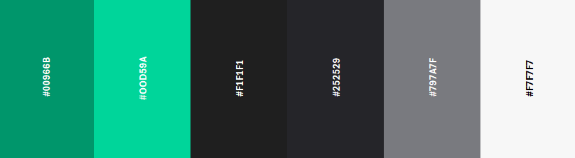
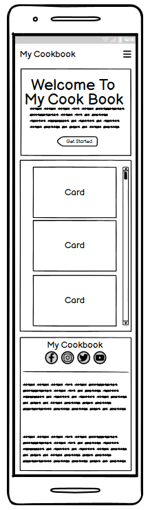
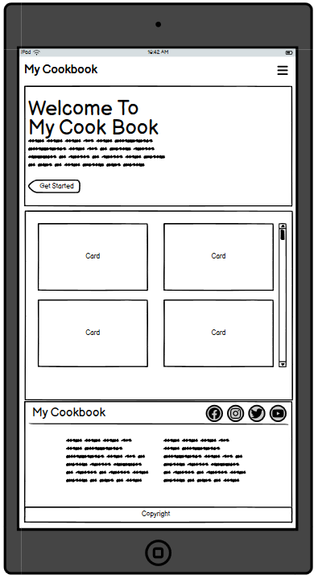
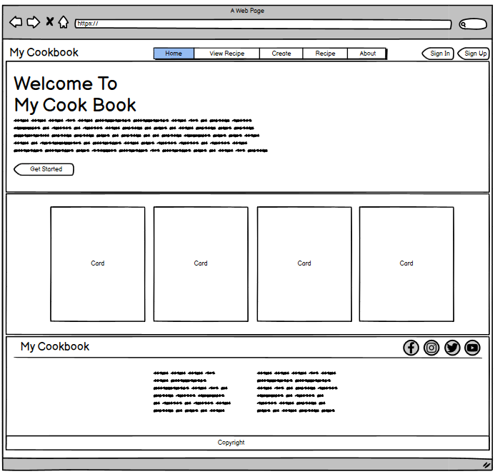

# My Cookbook

### Introduction

Welcome to my cookbook. This website has been created to allow the users to create and view there homemade recipes. 
You can also view other recipes, and share your recipes to socal media.

Visit the deployed webside [here]().

## Table of Contents

1. [User Experience (UX)](#user-experience-ux)
    1. [Project Goals](#project-goals)
    2. [User Stories](#user-stories)
    3. [Color Scheme](#color-scheme)
    4. [Typography](#typography)
    5. [Project Wireframes](#project-wireframes)
2. [Features](#features)
    1. [General](#general)
3. [Technologies Used](#technologies-used)
    1. [Languages Used](#languages-used)
    2. [Frameworks, Libraries and Programs Used](#frameworks-libraries-and-programs-used)
4. [Testing](#testing)
    1. [Testing User Stories](#testing-user-stories)
    2. [Code Validation](#code-validation)
    3. [Accessibility](#accessibility)
    4. [Tools Testing](#tools-testing)
    5. [Manual Testing](#manual-testing)
5. [Finished Product](#finished-product)
6. [Heroku Deployment](#heroku-deployment)
    1. [Heroku](#heroku)
7. [Credits](#credits)
    1. [Code](#code)
    2. [Images](#images)
8. [Achnowledgements](#acknowledgements)

## User Experience (UX)

### Project Goals

* The website provides a structure easy to understand and navigate
* The website has a responsive design to make it accessable accross all devices
* The website contains a database for storing created recipes
* The site allows the user to view a recipe and the cooking steps required for completing the recipe
* The website contains the tools for creating and managing a user account
* The site provides a calm and relaxing color scheme

### User Stories

* As a user i want to be able to view recipes created by others
* As a user i want to be able to create and manage a personal account
* As a user i want the tools available for creating a new recipe and adding the required cooking steps
* As a user i want to be able to edit my personal recipes
* I want to be able to share my recipes on social media platforms

### Color Scheme

### Typography

Mukta was used as the main font with sans-serif as a backup font incase Mukta fails to import.

### Project Wireframes

Page | Mobile | Tablet | Desktop
--- | --- | ---| ---
Home page |  |  | 

[Back to top ⇧](#My-Cookbook)

## Features

[Back to top ⇧](#My-Cookbook)

## Technologies Used

[Back to top ⇧](#My-Cookbook)

## Testing

[Back to top ⇧](#My-Cookbook)

## Finished Product

[Back to top ⇧](#My-Cookbook)

## Heroku Deployment

[Back to top ⇧](#My-Cookbook)

## Credits

### Images

* Hero image on mobile devices: "Green Leafy Vegetable Dish in Gray Steel Bowl With Fork" by Valeria Boltneva [Image Link](https://images.pexels.com/photos/842571/pexels-photo-842571.jpeg?auto=compress&cs=tinysrgb&w=600)

[Back to top ⇧](#My-Cookbook)

## Achnowledgements

[Back to top ⇧](#My-Cookbook)